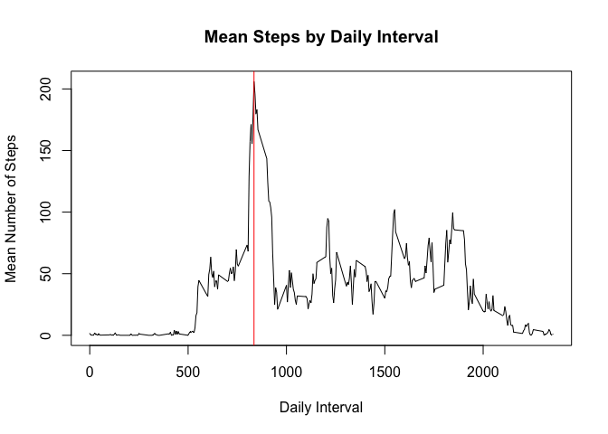

# Reproducible Research: Peer Assessment 1

```
## 
## Attaching package: 'dplyr'
## 
## The following object is masked from 'package:stats':
## 
##     filter
## 
## The following objects are masked from 'package:base':
## 
##     intersect, setdiff, setequal, union
```
## Loading and preprocessing the data

```r
data<- read.csv("activity.csv")
dates<- group_by(data, date)
```
## What is mean total number of steps taken per day?

```r
hist(data$steps, breaks= 50, main="Frequency of Steps Histogram", xlab="Number of Daily Steps")
```

 

```r
stmean<- mean(data$steps, na.rm=T)
stmean
```

```
## [1] 37.38
```

```r
stmedian<- median(data$steps, na.rm=T)
stmedian
```

```
## [1] 0
```
## What is the average daily activity pattern?

```r
dates<- group_by(data, interval)
intsum<- summarise(dates, mean=mean(steps, na.rm=T), median=median(steps, na.rm=T))
plot(intsum$interval, intsum$mean, type="l", main="Mean Steps by Daily Interval", xlab="Daily Interval", ylab="Mean Number of Steps")
abline(v=835, col="red")
```

 

```r
intsum$interval[which.max(intsum$mean)]
```

```
## [1] 835
```
## Imputing missing values

```r
Nas<-sum(is.na(data$steps))
Nas
```

```
## [1] 2304
```
## Are there differences in activity patterns between weekdays and weekends?

